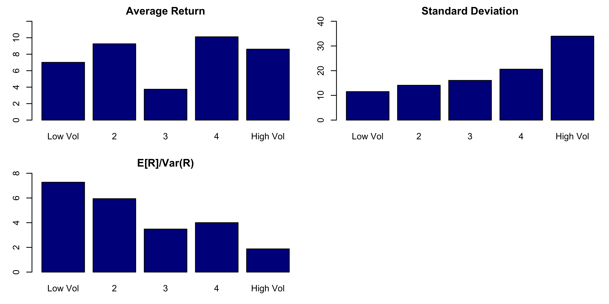
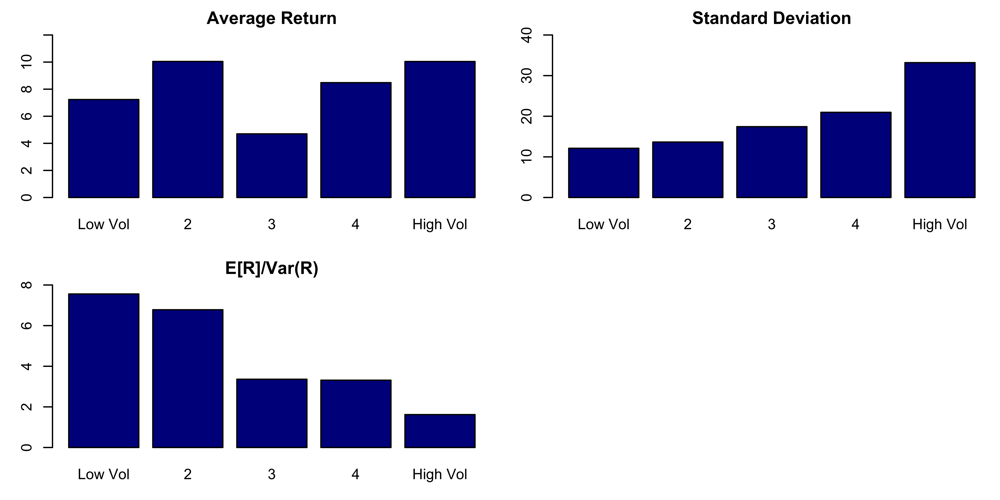

# Volatility-managed portfolios

## Methodology

The volatility-managed portfolio developed by Moreira and Muir (2017) is given by:
$f^\sigma_{t+1}=\frac{c}{\hat \sigma^2_t(f)} f_{t+1}$
where $f_{t+1}$ is the buy-and-hold portfolio excess return and, $\hat \sigma^2_t(f)$ is a proxy for the portfolio's conditional variance, given by: 
$\hat \sigma^2_t(f) = RV^2_t(f) = \sum^1_{d=1/D} \bigg(f_{t+d} - \frac{\sum^1_{d=1/D}f_{t+d}}{D}\bigg)^2$ and $\hat \sigma^2_{t,\text{new}}(f) = RV^2_t(f) = \frac{91}{22}\sum^{91}_{d=1} \bigg(f_{(t+1)-d} - \frac{\sum^{91}_{d=1}f_{(t+1)-d}}{91}\bigg)^2$.  
Here, $\hat \sigma^2_t(f)$ is used for the replication part of the analysis with $D$ equal to the number of days in the month $t$ and $\hat \sigma^2_{t,\text{new}}(f)$ is used for the new analysis part. The constant $c$ controls the average exposure of the strategy and is chosen in a way that the managed portfolio's unconditional standard deviation is equal to the standard deviation of the buy-and-hold portfolio. This means that $c$ can be obtained with the following formula: 
$\sigma^2\bigg(\frac{f_{t+1}}{\hat \sigma^2_t(f)}c\bigg) = \sigma^2(f_{t+1}) \Leftrightarrow c=\frac{\sigma(f_{t+1})}{\sigma(f_{t+1}/\hat \sigma^2_t(f))}$.

## Replication of findings from the paper (1)

<figcaption align = "center"><b>Figure 1: Sorts on the previous month’s volatility.</b></figcaption>  

## Replication of findings from the paper (2)

<figcaption align = "center"><b>Table 1: Volatility-Managed Factor Alphas.</b></figcaption>  

<table class="table" style="font-size: 10px; ">
<caption style="font-size: initial !important;">Volatility-Managed Factor Alphas</caption>
 <thead>
<tr><th style="border-bottom:hidden;padding-bottom:0; padding-left:5px;padding-right:5px;text-align: center; font-weight: bold; " colspan="2">
Panel A: Univariate Regressions
</th></tr>
<tr>
<th style="empty-cells: hide;border-bottom:hidden;" colspan="1"></th>
<th style="border-bottom:hidden;padding-bottom:0; padding-left:5px;padding-right:5px;text-align: center; " colspan="1">
(1)
</th>
</tr>
  <tr>
   <th style="text-align:left;">   </th>
   <th style="text-align:center;"> Mkt$^\sigma$ </th>
  </tr>
 </thead>
<tbody>
  <tr>
   <td style="text-align:left;width: 6cm; "> MktRF </td>
   <td style="text-align:center;"> 0.6 </td>
  </tr>
  <tr>
   <td style="text-align:left;width: 6cm; ">  </td>
   <td style="text-align:center;"> (0.02) </td>
  </tr>
  <tr>
   <td style="text-align:left;width: 6cm; "> Alpha ($\alpha$) </td>
   <td style="text-align:center;"> 4.9 </td>
  </tr>
  <tr>
   <td style="text-align:left;width: 6cm; ">  </td>
   <td style="text-align:center;"> (1.59) </td>
  </tr>
  <tr>
   <td style="text-align:left;width: 6cm; "> $N$ </td>
   <td style="text-align:center;"> 1073 </td>
  </tr>
  <tr>
   <td style="text-align:left;width: 6cm; "> $R^2$ </td>
   <td style="text-align:center;"> 0.36 </td>
  </tr>
  <tr>
   <td style="text-align:left;width: 6cm; "> RMSE </td>
   <td style="text-align:center;"> 51.68 </td>
  </tr>
</tbody>
</table>

<table class="table" style="font-size: 10px; ">
 <thead>
<tr><th style="border-bottom:hidden;padding-bottom:0; padding-left:5px;padding-right:5px;text-align: center; font-weight: bold; " colspan="2">
Panel B: Alphas Controlling for Fama-French Three Factors
</th></tr>
  <tr>
   <th style="text-align:left;">   </th>
   <th style="text-align:center;">  </th>
  </tr>
 </thead>
<tbody>
  <tr>
   <td style="text-align:left;width: 6cm; "> Alpha ($\alpha$) </td>
   <td style="text-align:center;"> 5.56 </td>
  </tr>
  <tr>
   <td style="text-align:left;width: 6cm; ">  </td>
   <td style="text-align:center;"> (1.58) </td>
  </tr>
</tbody>
</table>

## New analysis (1)

<figcaption align = "center"><b>Figure 2: Sorts on the previous month’s volatility.</b></figcaption>  

## New analysis (2)

<figcaption align = "center"><b>Table 2: Volatility-Managed Factor Alphas.</b></figcaption>  

<table class="table" style="font-size: 10px; ">
<caption style="font-size: initial !important;">Volatility-Managed Factor Alphas</caption>
 <thead>
<tr><th style="border-bottom:hidden;padding-bottom:0; padding-left:5px;padding-right:5px;text-align: center; font-weight: bold; " colspan="2">
Panel A: Univariate Regressions
</th></tr>
<tr>
<th style="empty-cells: hide;border-bottom:hidden;" colspan="1"></th>
<th style="border-bottom:hidden;padding-bottom:0; padding-left:5px;padding-right:5px;text-align: center; " colspan="1">
(1)
</th>
</tr>
  <tr>
   <th style="text-align:left;">   </th>
   <th style="text-align:center;"> Mkt$^\sigma$ </th>
  </tr>
 </thead>
<tbody>
  <tr>
   <td style="text-align:left;width: 6cm; "> MktRF </td>
   <td style="text-align:center;"> 0.67 </td>
  </tr>
  <tr>
   <td style="text-align:left;width: 6cm; ">  </td>
   <td style="text-align:center;"> (0.02) </td>
  </tr>
  <tr>
   <td style="text-align:left;width: 6cm; "> Alpha ($\alpha$) </td>
   <td style="text-align:center;"> 3.43 </td>
  </tr>
  <tr>
   <td style="text-align:left;width: 6cm; ">  </td>
   <td style="text-align:center;"> (1.4) </td>
  </tr>
  <tr>
   <td style="text-align:left;width: 6cm; "> $N$ </td>
   <td style="text-align:center;"> 1162 </td>
  </tr>
  <tr>
   <td style="text-align:left;width: 6cm; "> $R^2$ </td>
   <td style="text-align:center;"> 0.45 </td>
  </tr>
  <tr>
   <td style="text-align:left;width: 6cm; "> RMSE </td>
   <td style="text-align:center;"> 47.47 </td>
  </tr>
</tbody>
</table>

<table class="table" style="font-size: 10px; ">
 <thead>
<tr><th style="border-bottom:hidden;padding-bottom:0; padding-left:5px;padding-right:5px;text-align: center; font-weight: bold; " colspan="2">
Panel B: Alphas Controlling for Fama-French Three Factors
</th></tr>
  <tr>
   <th style="text-align:left;">   </th>
   <th style="text-align:center;">  </th>
  </tr>
 </thead>
<tbody>
  <tr>
   <td style="text-align:left;width: 6cm; "> Alpha ($\alpha$) </td>
   <td style="text-align:center;"> 3.93 </td>
  </tr>
  <tr>
   <td style="text-align:left;width: 6cm; ">  </td>
   <td style="text-align:center;"> (1.39) </td>
  </tr>
</tbody>
</table>

## References

Moreira, Alan, and Tyler Muir. 2017. “Volatility-Managed Portfolios.” The Journal of Finance 72: 1611–44. https://doi.org/10.1111/jofi.12513.

## Author

Ema Vargova
